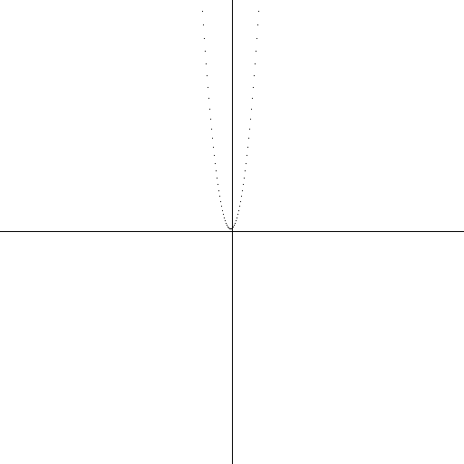

### Quadratic Function Plot Generation Using RISC-V assembly

This project allows generating a quadratic function plot and saving it as a BMP file using a program written in RISC-V assembly.

## Running the Program
To run the program, you can use the RARS simulator or compile and execute it in an appropriate RISC-V environment.

## How It Works

1. The program loads a BMP file as a template.
2. It draws the coordinate system.
3. It receives quadratic function coefficients from the user.
4. It calculates and plots the function graph.
5. It saves the modified BMP file.

## Project Structure
- `quadraticfunction.asm` - RISC-V assembly source code
- `example.bmp` - BMP file used as a base for drawing

The program handles and counts image padding so the image dimensions might be any.
Here are some example bmp images generated by the program:
- Image 512x512 pixels function: `f(x) = x^2+x+1`: 

- Image 512x512 pixels function: `fx(x) = 0.5x^2+x-1`:

- Image 122x122 pixels function: `f(x) = -x^2-2x+1`:

